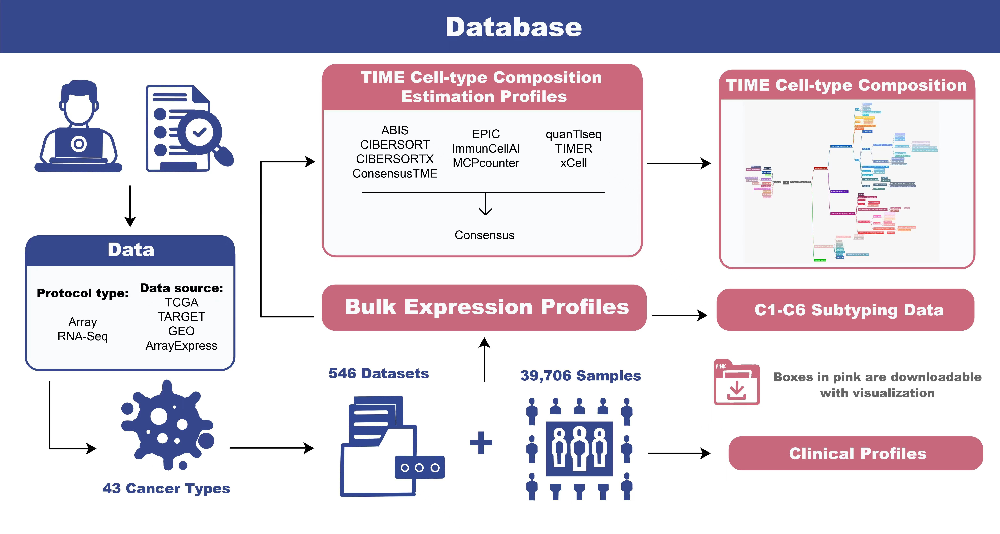
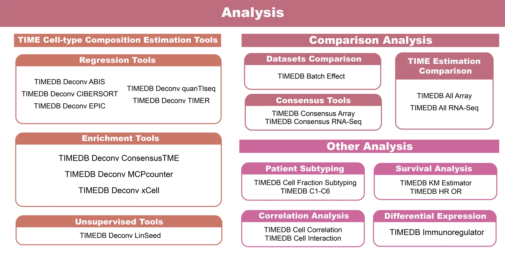
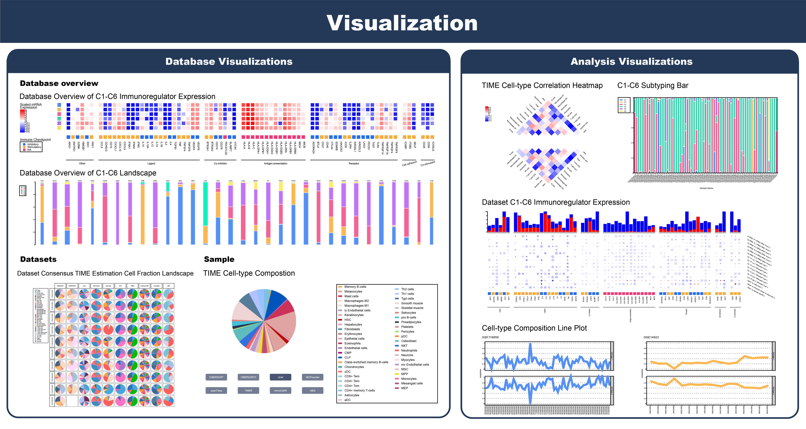

# Welcome to TIMEDB

**[TIMEDB](https://timedb.deepomics.org), an online human tumor immune micro-environment cell composition database with automatic analysis and interactive visualization**. 

We have systematically searched gene expression datasets of 43 cancer types from TCGA, Therapeutically Applicable Research to Generate Effective Treatments (TARGET), Gene Expression Omnibus (GEO), and Array Express portal from June 2021 - June 2022. As a result, we collected the RNA expression profiles from a total of **39,706** samples from **546** datasets of **43** cancer types. We manually curated the corresponding clinical information (treatment, survival, etc.) from different data sources to the same format, which at least three individuals have independently validated. 

We conducted TIME cell-type composition estimation using **ten state-of-the-art tools**, including ABIS, CIBERSORT, CIBERSORTx, EPIC, quanTIseq, TIMER, ConsensusTME, ImmuneCellAI, MCPcounter, and xCell. All processed expression data, curated clinical data, and TIME cell-type composition data are freely downloadable on TIMEDB. Furthermore, TIMEDB offers an automatic TIME analysis workflow, including the above-mentioned TIME cell-type composition estimation packages, TIME cell-type composition guided patient subtyping, survival analysis, correlation analysis, differential expression analysis, etc. Users can upload their gene expression data or select datasets from TIMEDB for independent or integrated analyses with simple mouse operations. 

Last but not least, TIMEDB supports the **interactive visualizations** of gene expression, TIME cell-type composition estimation, patient subtyping, survival, and correlation data from databases or analyses. Multiple interaction options are available, including informative tooltips, changeable plot size, edited labels, optional color picker, etc. All visualizations are downloadable in high-quality publication-ready format. 

## Help
For more information, please see TIMEDB (https://timedb.deepomics.org).
If you encounter any problems in use, you can describe it on the [issue](https://github.com/deepomicslab/TIMEDB/issues) page and we will deal with it as soon as possible.

## Contact us
Dr LI, Shuaicheng
Tat Chee Avenue, Kowloon, Hong Kong
Email: shuaicli@cityu.edu.hk

## Citation

@article{10.1093/nar/gkac1006,
    author = {Wang, Xueying and Chen, Lingxi and Liu, Wei and Zhang, Yuanzheng and Liu, Dawei and Zhou, Chenxin and Shi, Shuai and Dong, Jiajie and Lai, Zhengtao and Zhao, Bingran and Zhang, Wenjingyu and Cheng, Haoyue and Li, Shuaicheng},
    title = "{TIMEDB: tumor immune micro-environment cell composition database with automatic analysis and interactive visualization}",
    journal = {Nucleic Acids Research},
    year = {2022},
    month = {11}}
